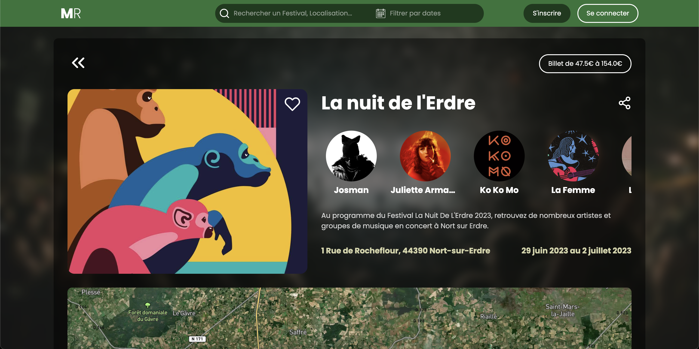

## Summary

- 🪧 [About](#About)
- 🚀 [Skills](#Skills)
- 📚 [Projects](#Projects)
- 📫 [Contact](#Contact)

## About

Formerly employed as a senior salesman for several years, I turned to web development in 2023.
I retrained with <a href="https://www.lewagon.com/fr/web-development-course">Le Wagon</a>, which gave me a foothold in the IT world.
At the end of my training, I was able to carry out a complete project using the Ruby language and its Rails framework, learn about the front-end and back-end, and learn the different facets of the web developer's job.

I'm currently looking for my first experience as a young developer. I'm keen to put my new skills into practice and contribute to a dynamic team. I'm particularly interested in roles that will allow me to continue learning and develop my mastery of new languages and technologies. I believe that every new project is an opportunity to learn and I'm always ready to take on new challenges. I'm passionate about technology and can't wait to start my career in this exciting field.

As well as my technical skills, I bring with me a passion for problem-solving and an insatiable curiosity. I'm convinced that every new project is an opportunity to learn and I'm always ready to take on new challenges. I'm also very interested in cybersecurity and the Internet of Things (IoT), two fast-growing areas that present countless opportunities for the future of web development.

## Skills

### Stack
##### Front-end
    
   

##### Back-end
   

##### Database
    
    

##### Server

##### Other
     

##### Communication

   

## Projects

### Latest projects
- [MusicRoad](https://www.musicroad.fr) - A web app to find music festivals around you, pick the ones you want to go on your favorite page and chat with other users about it on the chatroom.
 
  

## Contact

- 📫 How to reach me: [Send me an email](mailto:thomasdpr-pro@outlook.com)
- 👨🏻‍💻 LinkedIn: [Connect with me](https://www.linkedin.com/in/thomas-dupre/)
- 🌐 Website: [Visit my website](https://thomas-dupre.fr)

    
    

